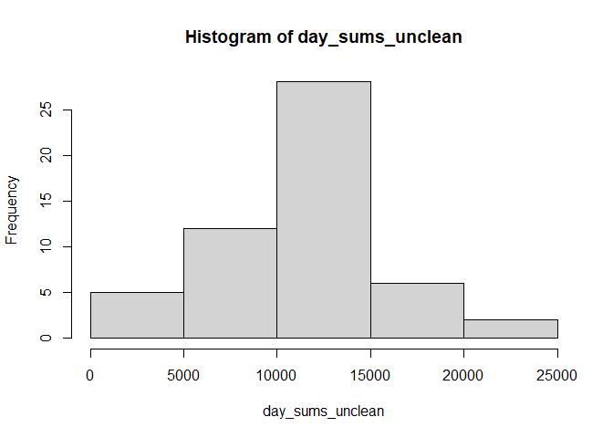
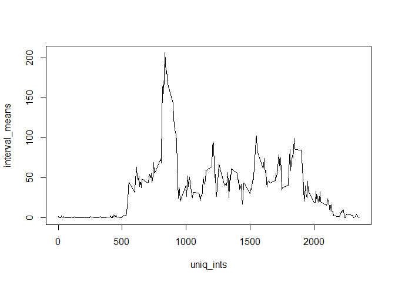
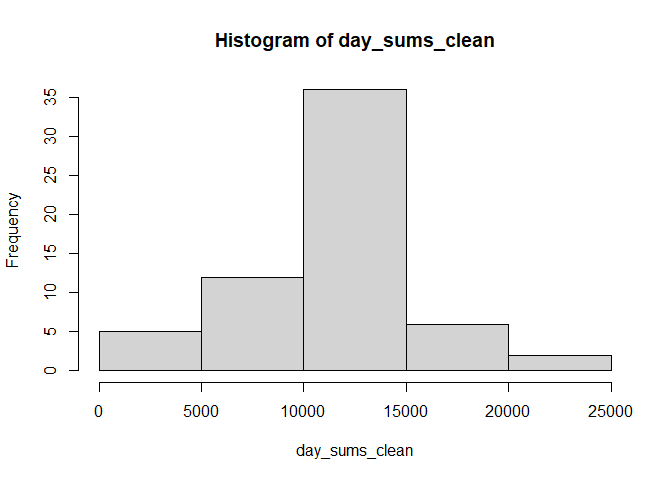
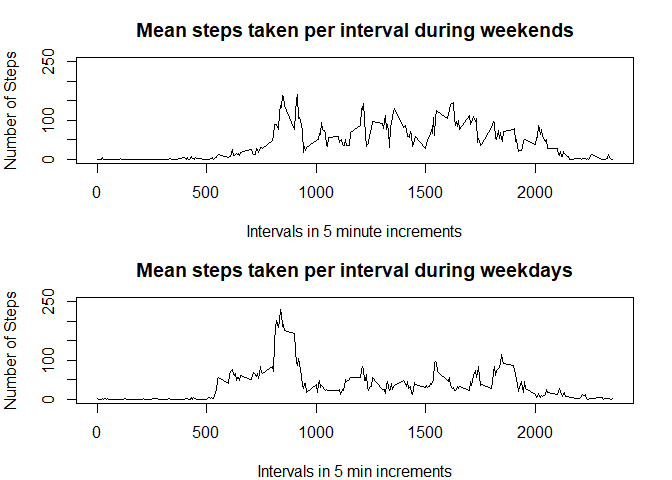

## Loading and preprocessing the data

Here we unzip and read in the data to 'my_data'. In order to avoid various
warnings, we convert the variables 'steps' and 'interval' from integer
to numeric type.


```r
unzip("repdata_data_activity.zip")
my_data <- read.csv("activity.csv")
my_data$steps <- as.numeric(my_data$steps)
my_data$interval <- as.numeric(my_data$interval)
```

## What is mean total number of steps taken per day?

Below, we simply sum 'steps' for each value of date, and follow with a
histogram and values of the mean and median for each sum by date.


```r
day_sums_unclean <- tapply(my_data$steps,my_data$date, sum)
library(ggplot2)
```

```
## Warning: package 'ggplot2' was built under R version 4.3.2
```

```r
hist(day_sums_unclean)
```

<!-- -->

```r
avg_unclean <-mean(day_sums_unclean,na.rm=TRUE)
avg_unclean
```

```
## [1] 10766.19
```

```r
med_unclean <- median(day_sums_unclean,na.rm=TRUE)
med_unclean
```

```
## [1] 10765
```

## What is the average daily activity pattern?

We compute the daily average steps for each time increment and generate the
corresponding plot.


```r
interval_means <- tapply(my_data$steps,my_data$interval, mean,na.rm=TRUE)
uniq_ints <- unique(my_data$interval)
plot(uniq_ints,interval_means,type = "l")
```

<!-- -->

We can pinpoint the time increment on the graph where the average daily steps is maximized.


```r
my_data$interval[which.max(interval_means)]
```

```
## [1] 835
```

## Inputing missing values

The snippet below gives the number of rows that are missing values for 'steps'.


```r
sum(is.na(my_data$steps))
```

```
## [1] 2304
```

The missing step values are replaced by the daily average for that time interval
 computed from the non-missing values.


```r
rep_list <- rep(interval_means,61)
my_data_clean <- my_data
my_data_clean$steps[is.na(my_data$steps)] = rep_list[is.na(my_data$steps)]
```

Consider the histogram below and the adjusted means and medians.


```r
day_sums_clean <- tapply(my_data_clean$steps,my_data_clean$date, sum)
hist(day_sums_clean)
```

<!-- -->

```r
avg_clean <-mean(day_sums_clean,na.rm=TRUE)
avg_clean
```

```
## [1] 10766.19
```

```r
med_clean <- median(day_sums_clean,na.rm=TRUE)
med_clean
```

```
## [1] 10766.19
```

Cleaning by mean replacement vs not cleaning increases the frequency of the
 middle bin [10000,15000] but does not appear to affect the frequencies of the
  other bins. The histogram is qualitatively unchanged. The cleaned mean is
  identical to the uncleaned mean, and there is only slight difference in the
  cleaned and uncleaned medians. In this instance, replacing missing values has 
  virtually no impact.

## Are there differences in activity patterns between weekdays and weekends?

In the cleaned data set, We convert the character dates to the standard date
class.


```r
my_data_clean$date <- strptime(my_data_clean$date, format="%Y-%m-%d")
Date <- my_data_clean$date 
```

The following code creates  factor variable with two levels, 
"weekday" and "weekend".


```r
is_weekend <- (weekdays(Date) == "Saturday") | (weekdays(Date) == "Sunday")
day_type <- factor(is_weekend,labels = c("weekday","weekend"))
my_data_clean = cbind(my_data_clean,day_type)
```

This allows us to subset by weekend/weekday status.


```r
weekend_data <- my_data_clean[is_weekend==1,]
weekday_data <- my_data_clean[is_weekend==0,]
```

Here are the plots of the activity levels for each time interval for both the
  weekday and corresponding averages for the subsetted weekend and weekday data
  sets.


```r
weekend_means <-tapply(weekend_data$steps,weekend_data$interval,mean,na.rm=TRUE)
weekday_means <-tapply(weekday_data$steps,weekday_data$interval,mean,na.rm=TRUE)

par(mfrow=c(2, 1), mar=c(4, 4, 3, 2))
plot(uniq_ints, weekend_means, type="l",
     main="Mean steps taken per interval during weekends",
     xlab="Intervals in 5 minute increments", ylab="Number of Steps",lwd=1.5,
     ylim=c(0, 250))
plot(uniq_ints, weekday_means, type="l",
     main="Mean steps taken per interval during weekdays",
     xlab="Intervals in 5 min increments", ylab="Number of Steps",lwd=1.5,
     ylim=c(0, 250))
```

<!-- -->

 It appears that overall activity increases over the weekends, and is more
 uniformly distributed throughout the day without any single large peak.
